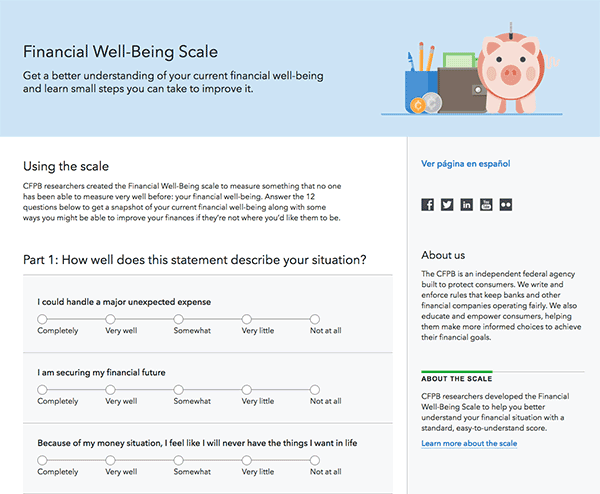

# Financial Well-Being Scale

A prototype of a web version of the CFPB’s Financial Well-Being Scale.



## Dependencies

- [Gulp](http://gulpjs.com): task runner for pulling in assets,
  linting and concatenating code, etc.
- [Less](http://lesscss.org): CSS pre-processor.
- [Capital Framework](https://cfpb.github.io/capital-framework/getting-started):
  User interface pattern-library produced by the CFPB.

**NOTE:** If you're new to Capital Framework, we encourage you to
[start here](https://cfpb.github.io/capital-framework/getting-started).

## Installation

1. Install [Node.js](http://nodejs.org) however you'd like.
2. Install [Gulp](http://gulpjs.com):
  ```bash
  npm install -g gulp bower
  ```
3. Next, install the dependencies and compile the project with:
  ```bash
  ./setup.sh
  ```
  __NOTE:__ To re-install and rebuild all the site’s assets run
  `./setup.sh` again. See the [usage](#usage) section on updating all the
  project dependencies.

## Usage

Each time you fetch from the upstream repository (this repo), run `./setup.sh`.
This setup script will remove and re-install the project dependencies and
rebuild the site's JavaScript and CSS assets.

To watch for changes in the source code and automatically update the running
site, open a terminal and run:

```bash
gulp watch
```

## How to test the software

After running `./setup.sh` or compiling with Gulp,
you can view the site in a browser by opening `/dist/index.html`.
Alternatively, you may want to use a local server with something like
`python -m SimpleHTTPServer`.

## Known issues

This prototype was done for a one-day make-a-thon, so it’s still rough. Here are
some things that need to be addressed to turn this into a final product:

- With the exception of the questions themselves, all the content was whipped up
by the make-a-thon team and needs to be reviewed and rewritten.
- The hero illustration is a placeholder and should be replaced.
- The “Ver página en español” link is meant to link to the Spanish version of
the scale (which exists on paper).
- All of the questions are required. Right now, form submission is disabled
until all questions are answered, but that should be changed to use our standard
error messaging.
- The scale questions are looking pretty good on large screens, but on small
screens they’re meant to transform to our standard large-target-area radio
buttons (like the last two questions).
- The scale questions aren’t currently in Capital Framework (and the HTML/CSS
used for them in this prototype is pretty hack-y).
- The paper version of the scale has some additional prompts that go along with
the scale points that we weren’t able to accommodate with our current scale
question style. We might want to look into reworking the scale question style
to be able to include those prompts.
- None of the score calculations have tests yet.
- The content of the results page is meant to change based on your score.

## Getting involved

We welcome your feedback and contributions. See the
[contribution guidelines](https://github.com/cfpb/open-source-project-template/blob/master/CONTRIBUTING.md)
for more details.

Additionally, you may want to consider
[contributing to the Capital Framework](https://cfpb.github.io/capital-framework/contributing/),
which is the front-end pattern library used in this project.


----

## Open source licensing info
1. [TERMS](TERMS.md)
2. [LICENSE](LICENSE)
3. [CFPB Source Code Policy](https://github.com/cfpb/source-code-policy/)


----

## Credits and references

1. Projects that inspired you
2. Related projects
3. Books, papers, talks, or other sources that have meaningful impact or
   influence on this project
